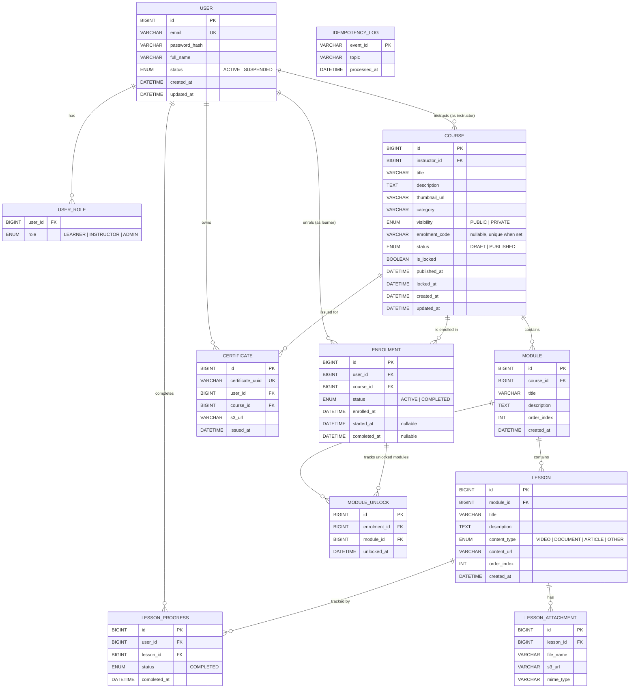

# LearnPulse — Entity Relationship Diagram & Database Schema
**Version:** 1.1
**Companion to:** `PRD.md`
**Engine:** MySQL 8 (InnoDB, `utf8mb4`)

---

## 0. Database Topology

LearnPulse uses three independent MySQL databases — one per backend service. Cross-service references (e.g. `courses.instructor_id` pointing to a user) are **application-level references only**; they are not enforced by database foreign-key constraints across service boundaries.

| Service | App path | Database name | Tables owned |
|---|---|---|---|
| **User Service** | `apps/user-service` | `learnpulse_users` | `users`, `user_roles` |
| **LMS Service** | `apps/api` | `learnpulse_lms` | `courses`, `modules`, `lessons`, `lesson_attachments`, `enrolments`, `lesson_progress`, `module_unlocks`, `idempotency_log` (email consumer), `outbox_events` |
| **Certificate Service** | `apps/cert-service` | `learnpulse_certs` | `certificates`, `idempotency_log` (certificate consumer) |

> Each service runs its own Flyway migrations at startup against its own datasource. There are no shared tables.

---

## 1. ERD (Mermaid)

---

## 2. Table Definitions

> Notation: `PK` = primary key, `FK` = foreign key, `UK` = unique key, `IDX` = secondary index. All tables use InnoDB and `utf8mb4_unicode_ci`. `ON DELETE CASCADE` is used where the parent record is the natural owner.

### 2.1 `users`
| Column | Type | Notes |
|---|---|---|
| `id` | `BIGINT UNSIGNED` | PK, auto-increment |
| `email` | `VARCHAR(254)` | UK, lowercased on insert |
| `password_hash` | `VARCHAR(72)` | BCrypt, cost 12 |
| `full_name` | `VARCHAR(120)` | |
| `status` | `ENUM('ACTIVE','SUSPENDED')` | default `'ACTIVE'` |
| `created_at` | `DATETIME(6)` | default `NOW(6)` |
| `updated_at` | `DATETIME(6)` | `ON UPDATE NOW(6)` |

### 2.2 `user_roles`
| Column | Type | Notes |
|---|---|---|
| `user_id` | `BIGINT UNSIGNED` | FK → `users.id`, `ON DELETE CASCADE` |
| `role` | `ENUM('LEARNER','INSTRUCTOR','ADMIN')` | |

PK: composite `(user_id, role)`.

### 2.3 `courses`
| Column | Type | Notes |
|---|---|---|
| `id` | `BIGINT UNSIGNED` | PK |
| `instructor_id` | `BIGINT UNSIGNED` | FK → `users.id`, `ON DELETE RESTRICT` |
| `title` | `VARCHAR(200)` | |
| `description` | `TEXT` | |
| `thumbnail_url` | `VARCHAR(1024)` | nullable |
| `category` | `VARCHAR(80)` | nullable |
| `visibility` | `ENUM('PUBLIC','PRIVATE')` | |
| `enrolment_code` | `VARCHAR(16)` | UK, nullable; only set when `visibility='PRIVATE'` |
| `status` | `ENUM('DRAFT','PUBLISHED')` | default `'DRAFT'` |
| `is_locked` | `TINYINT(1)` | default `0`; flips to `1` on first `enrolments.started_at` |
| `published_at` | `DATETIME(6)` | nullable |
| `locked_at` | `DATETIME(6)` | nullable |
| `created_at` | `DATETIME(6)` | |
| `updated_at` | `DATETIME(6)` | |

Indexes: `IDX(instructor_id)`, `IDX(status, visibility)`.

### 2.4 `modules`
| Column | Type | Notes |
|---|---|---|
| `id` | `BIGINT UNSIGNED` | PK |
| `course_id` | `BIGINT UNSIGNED` | FK → `courses.id`, `ON DELETE CASCADE` |
| `title` | `VARCHAR(200)` | |
| `description` | `TEXT` | |
| `order_index` | `INT UNSIGNED` | |
| `created_at` | `DATETIME(6)` | |

UK: `(course_id, order_index)`. Index: `IDX(course_id)`.

### 2.5 `lessons`
| Column | Type | Notes |
|---|---|---|
| `id` | `BIGINT UNSIGNED` | PK |
| `module_id` | `BIGINT UNSIGNED` | FK → `modules.id`, `ON DELETE CASCADE` |
| `title` | `VARCHAR(200)` | |
| `description` | `TEXT` | |
| `content_type` | `ENUM('VIDEO','DOCUMENT','ARTICLE','OTHER')` | |
| `content_url` | `VARCHAR(1024)` | external/S3 URL |
| `order_index` | `INT UNSIGNED` | |
| `created_at` | `DATETIME(6)` | |

UK: `(module_id, order_index)`. Index: `IDX(module_id)`.

### 2.6 `lesson_attachments`
| Column | Type | Notes |
|---|---|---|
| `id` | `BIGINT UNSIGNED` | PK |
| `lesson_id` | `BIGINT UNSIGNED` | FK → `lessons.id`, `ON DELETE CASCADE` |
| `file_name` | `VARCHAR(255)` | |
| `s3_url` | `VARCHAR(1024)` | |
| `mime_type` | `VARCHAR(120)` | |

### 2.7 `enrolments`
| Column | Type | Notes |
|---|---|---|
| `id` | `BIGINT UNSIGNED` | PK |
| `user_id` | `BIGINT UNSIGNED` | FK → `users.id`, `ON DELETE CASCADE` |
| `course_id` | `BIGINT UNSIGNED` | FK → `courses.id`, `ON DELETE CASCADE` |
| `status` | `ENUM('ACTIVE','COMPLETED')` | default `'ACTIVE'` |
| `enrolled_at` | `DATETIME(6)` | |
| `started_at` | `DATETIME(6)` | nullable; setting this triggers course lock |
| `completed_at` | `DATETIME(6)` | nullable |

UK: `(user_id, course_id)`. Indexes: `IDX(course_id, status)`, `IDX(user_id, status)`.

### 2.8 `lesson_progress`
| Column | Type | Notes |
|---|---|---|
| `id` | `BIGINT UNSIGNED` | PK |
| `user_id` | `BIGINT UNSIGNED` | FK → `users.id`, `ON DELETE CASCADE` |
| `lesson_id` | `BIGINT UNSIGNED` | FK → `lessons.id`, `ON DELETE CASCADE` |
| `status` | `ENUM('COMPLETED')` | only completed records exist; absence = not started |
| `completed_at` | `DATETIME(6)` | |

UK: `(user_id, lesson_id)`. Status is irreversible per PRD §4.2.

### 2.9 `module_unlocks`
| Column | Type | Notes |
|---|---|---|
| `id` | `BIGINT UNSIGNED` | PK |
| `enrolment_id` | `BIGINT UNSIGNED` | FK → `enrolments.id`, `ON DELETE CASCADE` |
| `module_id` | `BIGINT UNSIGNED` | FK → `modules.id`, `ON DELETE CASCADE` |
| `unlocked_at` | `DATETIME(6)` | |

UK: `(enrolment_id, module_id)`.

### 2.10 `certificates`
| Column | Type | Notes |
|---|---|---|
| `id` | `BIGINT UNSIGNED` | PK |
| `certificate_uuid` | `CHAR(36)` | UK, externally visible |
| `user_id` | `BIGINT UNSIGNED` | FK → `users.id`, `ON DELETE CASCADE` |
| `course_id` | `BIGINT UNSIGNED` | FK → `courses.id`, `ON DELETE CASCADE` |
| `s3_url` | `VARCHAR(1024)` | object key, signed on download |
| `issued_at` | `DATETIME(6)` | |

UK: **`(user_id, course_id)`** — Layer 1 of the exactly-once certificate guarantee (PRD §6.4).

### 2.11 `idempotency_log`
| Column | Type | Notes |
|---|---|---|
| `event_id` | `CHAR(36)` | PK (UUID v4 from Kafka event) |
| `topic` | `VARCHAR(80)` | for observability |
| `processed_at` | `DATETIME(6)` | |

Inserted in the **same DB transaction** as the certificate row — Layer 2 of exactly-once (PRD §6.4).

---

## 3. Critical Invariants

1. `lesson_progress.status` only ever takes the value `COMPLETED`. There is no row when a lesson hasn't been started.
2. `courses.is_locked = 1` ⇒ no `INSERT` / `UPDATE` / `DELETE` is allowed against `modules`, `lessons`, or `lesson_attachments` for that course. Enforced at the service layer; the API returns `409 Conflict`.
3. A row in `certificates` MUST be inserted in the same transaction as the matching row in the Certificate Service's `idempotency_log`. The unique constraint on `(user_id, course_id)` plus the PK on `idempotency_log.event_id` gives exactly-once delivery even under Kafka redelivery.
4. `enrolments.started_at` is monotonic — once set, never cleared. The first `started_at` write to any enrolment for a course is also the trigger for `courses.is_locked = 1` and `courses.locked_at`.
5. `enrolments.status = COMPLETED` ⇒ a `course.completed` Kafka event has been (or is about to be) published. The transition happens before the event is produced.
6. Cross-service user references (`courses.instructor_id`, `enrolments.user_id`, `certificates.user_id`, etc.) are application-enforced only. The LMS Service and Certificate Service never issue DB-level FK constraints that cross into the User Service database.

---

## 4. Migration Plan (Flyway)

Each service manages its own Flyway migrations independently.

### User Service — `apps/user-service/src/main/resources/db/migration/`

| Version | File | Purpose |
|---|---|---|
| V1 | `V1__create_users_and_roles.sql` | `users`, `user_roles` |
| V2 | `V2__seed_admin.sql` | First admin account (reads from env vars at startup) |

### LMS Service — `apps/api/src/main/resources/db/migration/`

| Version | File | Purpose |
|---|---|---|
| V1 | `V1__create_courses.sql` | `courses` |
| V2 | `V2__create_modules_and_lessons.sql` | `modules`, `lessons`, `lesson_attachments` |
| V3 | `V3__create_enrolments_and_progress.sql` | `enrolments`, `lesson_progress`, `module_unlocks` |
| V4 | `V4__create_idempotency_and_outbox.sql` | `idempotency_log` (email consumer), `outbox_events` |

> `courses.instructor_id` references a user ID from the User Service. The FK is enforced at the application layer only — no DB-level constraint across service databases.

### Certificate Service — `apps/cert-service/src/main/resources/db/migration/`

| Version | File | Purpose |
|---|---|---|
| V1 | `V1__create_certificates.sql` | `certificates` (with composite UK `(user_id, course_id)`), `idempotency_log` (certificate consumer) |

---

*End of Document*
