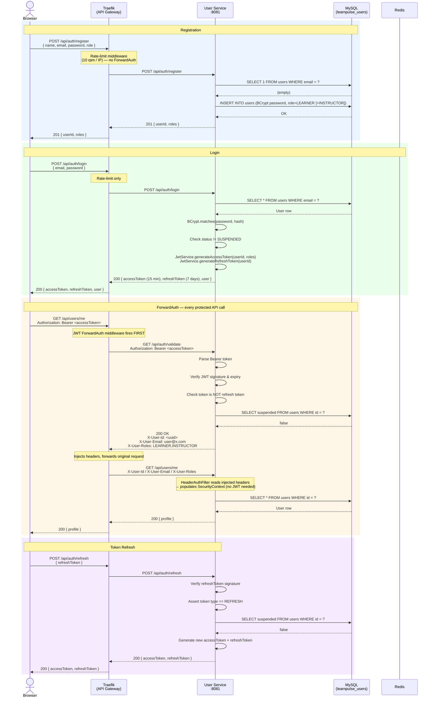
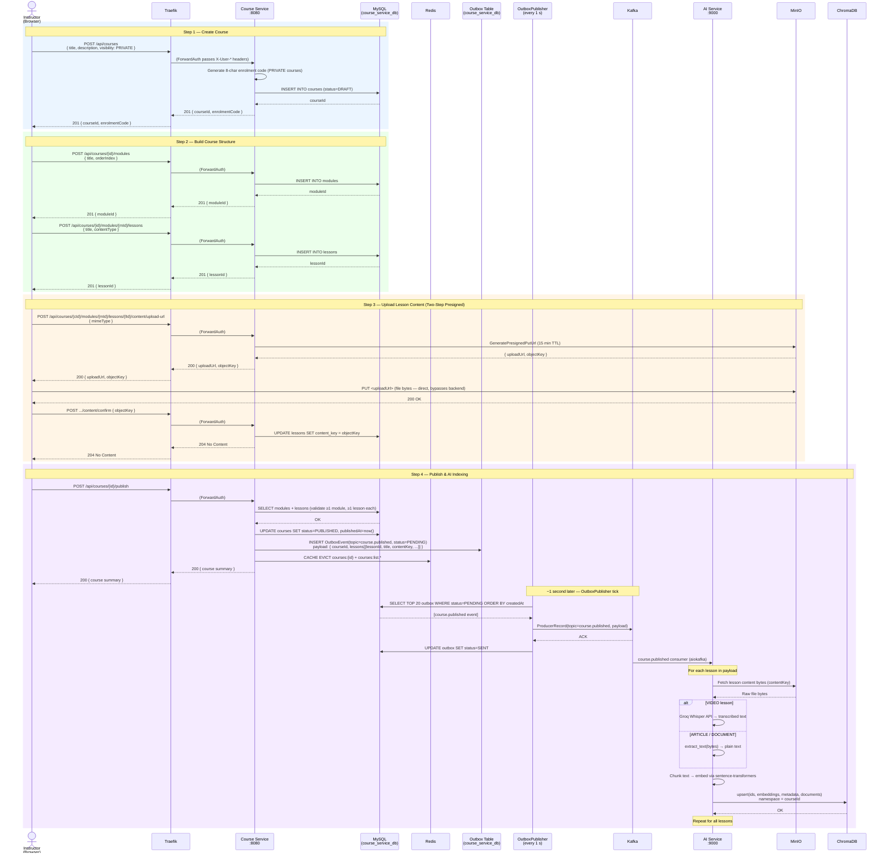
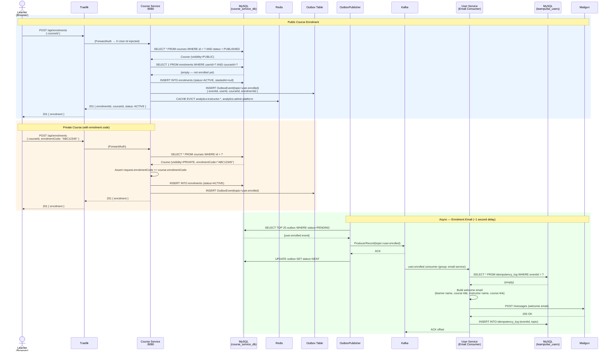
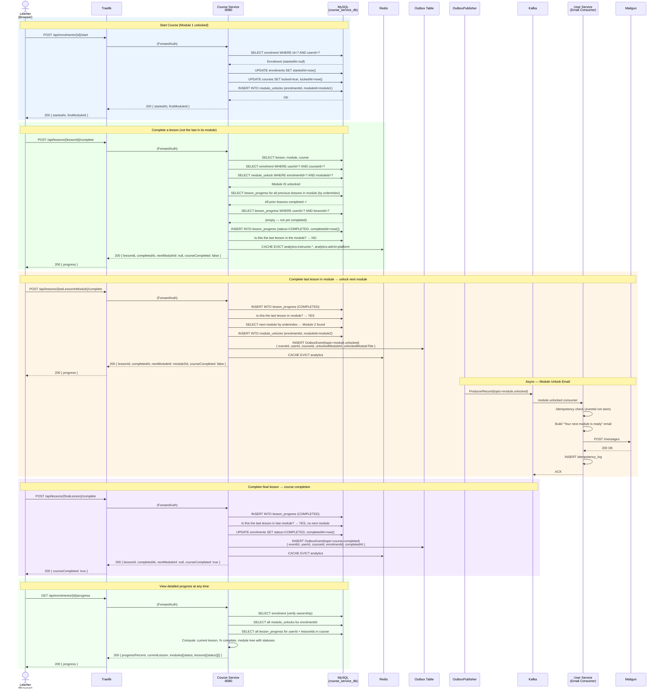
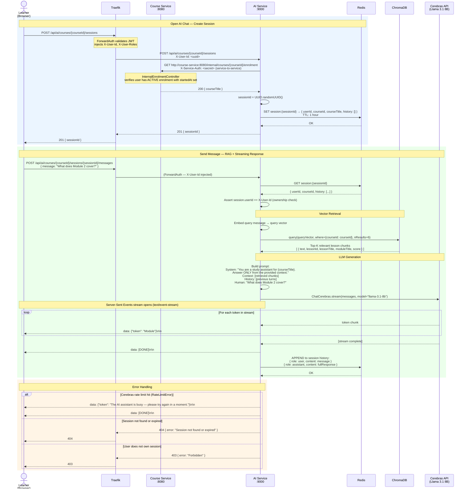

# LearnPulse — Sequence Diagrams

Six end-to-end flows. Each diagram is accurate to the actual implementation.

---

## 1. Authentication Flow

Covers registration, login, and how Traefik ForwardAuth validates every subsequent request.



---

## 2. Course Publishing Flow

An instructor creates, builds, and publishes a course. On publish, the AI service automatically indexes all lesson content via Kafka.



---

## 3. Enrolment Flow

A learner finds and enrols in a course. An async email is delivered via Kafka.



---

## 4. Learning Flow

A learner starts a course, completes lessons, unlocks modules, and finishes the course.



---

## 5. Certificate Generation Flow

Triggered automatically when a learner completes their final lesson. The system guarantees exactly-once PDF issuance via two-layer idempotency.

```mermaid
sequenceDiagram
    participant Kafka
    participant CertC as CertificateConsumer<br/>(cert-service)
    participant CertSvc as CertificateService
    participant CertDB as MySQL<br/>(learnpulse_certs)
    participant USC as UserServiceClient<br/>(REST)
    participant CSC as CourseServiceClient<br/>(REST)
    participant US as User Service<br/>:8081
    participant CoS as Course Service<br/>:8080
    participant PDF as PdfService<br/>(Thymeleaf + Flying Saucer)
    participant S3 as MinIO / S3
    participant Outbox as Outbox Table<br/>(learnpulse_certs)
    participant Publisher as OutboxPublisher<br/>(cert-service)
    participant EmailKafka as Kafka
    participant EmailUS as User Service<br/>(Email Consumer)
    participant Mailgun
    actor Learner

    %% ── CONSUME COURSE.COMPLETED ──────────────────────────────────
    rect rgb(235, 245, 255)
        Note over Kafka,CertDB: Layer 1 — Idempotency Check
        Kafka->>CertC: course.completed<br/>{ eventId, userId, courseId, enrolmentId, completedAt }
        CertC->>CertSvc: issue(CourseCompletedEvent)
        CertSvc->>CertDB: SELECT 1 FROM idempotency_log WHERE eventId = ?
        CertDB-->>CertSvc: (empty — first time)
    end

    %% ── FETCH EXTERNAL DATA ───────────────────────────────────────
    rect rgb(235, 255, 235)
        Note over CertSvc,CoS: Fetch learner + course details
        CertSvc->>USC: GET http://user-service:8081/internal/users/{userId}
        USC->>US: Internal REST call
        US-->>USC: { fullName, email }
        USC-->>CertSvc: UserInfo

        CertSvc->>CSC: GET http://course-service:8080/internal/courses/{courseId}
        CSC->>CoS: Internal REST call
        CoS-->>CSC: { title, instructorId }
        CSC-->>CertSvc: CourseInfo

        CertSvc->>USC: GET http://user-service:8081/internal/users/{instructorId}
        USC->>US: Internal REST call
        US-->>USC: { fullName }
        USC-->>CertSvc: InstructorInfo
    end

    %% ── GENERATE PDF ──────────────────────────────────────────────
    rect rgb(255, 245, 230)
        Note over CertSvc,S3: Generate PDF and upload to S3
        CertSvc->>CertSvc: Generate certUuid = UUID.randomUUID()
        CertSvc->>PDF: generateCertificate(learnerName, courseTitle,<br/>instructorName, certUuid, issuedDate)
        Note over PDF: Thymeleaf renders HTML template<br/>Flying Saucer converts HTML → PDF bytes
        PDF-->>CertSvc: byte[] pdfBytes

        CertSvc->>S3: PUT certificates/{userId}/{courseId}/{certUuid}.pdf
        S3-->>CertSvc: OK

        CertSvc->>S3: generatePresignedGetUrl(key, 7 days)
        S3-->>CertSvc: downloadUrl
    end

    %% ── ATOMIC COMMIT ─────────────────────────────────────────────
    rect rgb(245, 235, 255)
        Note over CertSvc,Outbox: Single DB transaction (exactly-once guarantee)
        CertSvc->>CertDB: BEGIN TRANSACTION
        CertSvc->>CertDB: INSERT INTO certificates<br/>(userId, courseId, s3Key, learnerName, courseName)<br/>UK(userId, courseId) → duplicate throws DataIntegrityViolationException
        CertSvc->>CertDB: INSERT INTO idempotency_log (eventId, "course.completed")
        CertSvc->>Outbox: INSERT OutboxEvent(topic=certificate.generated)<br/>{ eventId, userId, courseId, certificateId, s3Key, downloadUrl, issuedAt }
        CertSvc->>CertDB: COMMIT
        CertDB-->>CertSvc: OK
        CertC-->>Kafka: ACK offset
    end

    %% ── DUPLICATE GUARD ───────────────────────────────────────────
    rect rgb(255, 235, 235)
        Note over Kafka,CertC: If Kafka redelivers the same event (crash before ACK)
        Kafka->>CertC: course.completed (same eventId — redelivery)
        CertC->>CertSvc: issue(event)
        CertSvc->>CertDB: SELECT 1 FROM idempotency_log WHERE eventId = ?
        CertDB-->>CertSvc: FOUND
        CertSvc-->>CertC: return null (skip)
        CertC-->>Kafka: ACK (discard duplicate)
    end

    %% ── CERTIFICATE EMAIL ─────────────────────────────────────────
    rect rgb(235, 255, 250)
        Note over Publisher,Mailgun: Async — Certificate Delivery Email
        Publisher->>EmailKafka: ProducerRecord(topic=certificate.generated)
        EmailKafka-->>Publisher: ACK
        Publisher->>Outbox: UPDATE status=SENT

        EmailKafka->>EmailUS: certificate.generated consumer (group: email-service)
        EmailUS->>EmailUS: Idempotency check (eventId not seen)
        EmailUS->>EmailUS: Build congratulatory email<br/>(learner name, course name, PDF download link)
        EmailUS->>Mailgun: POST /messages
        Mailgun-->>EmailUS: 200 OK
        EmailUS->>EmailUS: INSERT idempotency_log
        EmailUS-->>EmailKafka: ACK
    end

    %% ── LEARNER DOWNLOADS CERTIFICATE ────────────────────────────
    rect rgb(240, 248, 255)
        Note over Learner,S3: Learner downloads certificate from dashboard
        Learner->>Traefik: GET /api/learner/certificates
        Traefik->>CertC: (ForwardAuth)
        Note over CertC: CertificateController
        CertC->>CertDB: SELECT * FROM certificates WHERE userId = ?
        CertDB-->>CertC: [{ certUuid, courseName, issuedAt, s3Key }]
        CertC-->>Traefik: 200 [{ certUuid, courseName, issuedAt }]
        Traefik-->>Learner: 200 [{ certificates }]

        Learner->>Traefik: GET /api/certificates/{uuid}/download
        Traefik->>CertC: (ForwardAuth)
        CertC->>CertDB: SELECT s3Key WHERE uuid=? AND userId=?
        CertC->>S3: generatePresignedGetUrl(key, 1 hour)
        S3-->>CertC: presignedUrl
        CertC-->>Traefik: 302 Redirect → presignedUrl
        Traefik-->>Learner: 302 → S3 presigned URL
        Learner->>S3: GET <presignedUrl>
        S3-->>Learner: PDF bytes
    end
```



---

## 6. AI Study Assistant Flow

Triggered when a learner opens the AI chat tab inside a course they have started.



---

## Architecture Summary

```
┌──────────────────────────────────────────────────────────────────────────────┐
│                           Request Flows at a Glance                           │
├────────────────────────┬────────────────────────────────────────────────────┤
│ Auth (register/login)  │ Browser → Traefik (rate-limit) → User Service      │
│ Any protected endpoint │ Browser → Traefik → ForwardAuth → User Service     │
│                        │        → inject X-User-* headers → target service  │
│ Course CRUD / enrol    │ Traefik → Course Service → MySQL + Redis + Outbox   │
│ Certificate            │ Kafka (course.completed) → Cert Service → S3       │
│                        │ → Kafka (cert.generated) → User Service → Mailgun  │
│ AI chat                │ Traefik → AI Service → Course Service (enrolment)  │
│                        │        → ChromaDB (retrieval) → Cerebras (LLM)     │
│ Kafka events           │ All produced via Outbox pattern (at-least-once)     │
│                        │ All consumed with eventId idempotency (exactly-once)│
└────────────────────────┴────────────────────────────────────────────────────┘
```